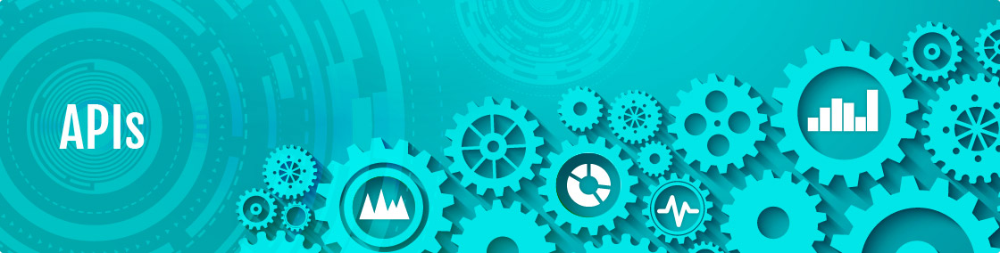
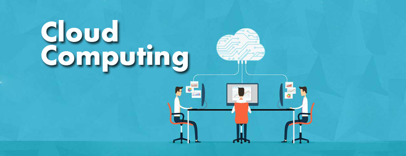

----

# Reto Master Semana 1 #

------

## Conceptos ##

- API
- COMPUTO EN LA NUBE
- AZURE
- DEVOPS
- INTELIGENCIA ARTIFICIAL

---

Una API es un conjunto de definiciones y protocolos que se utiliza para desarrollar e integrar el software de las aplicaciones. API significa interfaz de programación de aplicaciones.

Las API permiten que sus productos y servicios se comuniquen con otros, sin necesidad de saber cómo están implementados. Esto simplifica el desarrollo de las aplicaciones y permite ahorrar tiempo y dinero. Las API le otorgan flexibilidad; simplifican el diseño, la administración y el uso de las aplicaciones, y proporcionan oportunidades de innovación, lo cual es ideal al momento de diseñar herramientas y productos nuevos (o de gestionar los actuales).

### Tipos ###

* API privada

    Solo pueden acceder los desarrolladores y los usuarios de la organización. Estas API normalmente conectan procesos internos de los equipos con el fin de reducir el trabajo aislado y mejorar la colaboración.

* API publica
   
     Proporcionan a los desarrolladores externos un modo de acceder fácilmente a la información e integrarla entre herramientas. Una API abierta o pública ahorra a los desarrolladores tiempo, pues les permite conectar su plataforma con herramientas que ya tienen, lo que reduce la necesidad de crear funciones totalmente nuevas.

---

### Tipos ###

* Nube publica

En una nube pública, toda la infraestructura informática se encuentra en las instalaciones del proveedor de la nube, que ofrece estos servicios al cliente a través de Internet. El cliente no necesita mantener su propia TI y puede agregar rápidamente más usuarios o potencia informática según sea necesario. El proveedor de la nube tiene múltiples inquilinos que comparten su infraestructura de TI.

* Nube privada

Una nube privada es aquella utilizada exclusivamente por una organización. Podría estar alojada en las instalaciones de la organización o en el centro de datos del proveedor de la nube. Una nube privada proporciona el más alto nivel de seguridad y control.

* Nube Hibrida

Como su nombre lo indica, una nube híbrida es una combinación de las nubes pública y privada. En general, el cliente alojará las aplicaciones críticas para su empresa en sus propios servidores a fin de tener mayor seguridad y control, mientras que sus aplicaciones secundarias se almacenarán en las instalaciones del proveedor de la nube.

* Nube multiple

La principal diferencia entre la nube híbrida y la nube múltiple es el uso de múltiples dispositivos de almacenamiento y cómputo en la nube en una sola arquitectura. Con el objetivo de agregar algunas palabras clave en el cuerpo.

### Servicios de computo en la nube ###

* SaaS

El software como servicio (SaaS) es un modelo de entrega de software en el que las aplicaciones del cliente están alojadas en las instalaciones del proveedor de la nube. El cliente accede a sus aplicaciones a través de Internet. En lugar de pagar y mantener su propia infraestructura informática, el cliente aprovecha la suscripción al servicio de pago por uso.

* PaaS

La plataforma como servicio (PaaS) les brinda a los clientes la ventaja de acceder a las herramientas de desarrollo que necesitan para crear y administrar aplicaciones móviles y web sin necesidad de invertir ni mantener la infraestructura subyacente. El proveedor aloja la infraestructura y los componentes de middleware y el cliente accede a esos servicios a través de un navegador web.

* IaaS

La infraestructura como servicio (IaaS) permite a los clientes acceder a servicios de infraestructura a pedido a través de Internet. La ventaja clave es que el proveedor de la nube aloja los componentes de la infraestructura que proporcionan capacidad de cómputo, almacenamiento y red para que los suscriptores puedan ejecutar sus cargas de trabajo en la nube. El suscriptor de la nube generalmente es responsable de instalar, configurar, asegurar y mantener cualquier software que se encuentre dentro de la infraestructura basada en la nube, como la base de datos, el middleware y el software de aplicación.

---

La plataforma Azure está compuesta por más de 200 productos y servicios en la nube diseñados para ayudarle a dar vida a nuevas soluciones que permitan resolver las dificultades actuales y crear el futuro. Cree, ejecute y administre aplicaciones en varias nubes, en el entorno local y en el perímetro, con las herramientas y los marcos que prefiera.

[Desea saber mas...](https://azure.microsoft.com/es-es/overview/what-is-azure/)

---

### Definicion de DevOps ###

El término DevOps, que es una combinación de los términos ingleses development (desarrollo) y operations (operaciones), designa la unión de personas, procesos y tecnología para ofrecer valor a los clientes de forma constante.

### ¿Que significa DevOps para los equipos? ###

DevOps permite que los roles que antes estaban aislados (desarrollo, operaciones de TI, ingeniería de la calidad y seguridad) se coordinen y colaboren para crear productos mejores y más confiables. Al adoptar una cultura de DevOps junto con prácticas y herramientas de DevOps, los equipos adquieren la capacidad de responder mejor a las necesidades de los clientes, aumentar la confianza en las aplicaciones que crean y alcanzar los objetivos empresariales en menos tiempo.

[Desea saber mas...](https://azure.microsoft.com/es-mx/overview/what-is-devops/)

---

 

### ¿Como funciona la inteligencia artificial?  ###

Mediante el uso de las matemáticas y la lógica, un sistema informático simula el razonamiento que siguen las personas para aprender a partir de información nueva y tomar decisiones.

Un sistema informático con inteligencia artificial hace predicciones o realiza acciones basándose en los patrones de los datos disponibles y puede aprender de sus errores para ser más preciso. Una inteligencia artificial avanzada procesa la información nueva con suma rapidez y precisión, por lo que es muy útil para escenarios complejos como los automóviles sin conductor, los programas de reconocimiento de imágenes y los asistentes virtuales.

### Tipos ###

* Inteligencia Artificial Estrecha (IA estrecha)

La inteligencia artificial estrecha, a veces denominada “inteligencia artificial débil”, hace referencia a la capacidad de un sistema informático de realizar una tarea definida con precisión mejor que una persona.

La inteligencia artificial estrecha es el nivel más alto del desarrollo de inteligencia artificial que la humanidad ha alcanzado hasta ahora y todos los ejemplos de inteligencia artificial que se ven en el mundo real pertenecen a esta categoría, incluidos los vehículos autónomos y los asistentes digitales personales. Esto se debe a que, aunque parezca que la inteligencia artificial está pensando por sí misma en tiempo real, en realidad está coordinando varios procesos estrechos y toma decisiones dentro de un marco predeterminado. El “pensamiento” de la inteligencia artificial no implica consciencia ni emoción.

* Inteligencia Artificial General (IA general)

La inteligencia artificial general, a veces denominada “inteligencia artificial fuerte” o “inteligencia artificial de nivel humano”, hace referencia a la capacidad de un sistema informático de superar a las personas en cualquier tarea intelectual. Es el tipo de inteligencia artificial que se ve en las películas en las que los robots tienen pensamientos conscientes y actúan según sus propios motivos.

En teoría, un sistema informático que ha conseguido inteligencia artificial general podría resolver problemas sumamente complejos, emitir juicios en situaciones inciertas e incorporar conocimientos previos a su razonamiento actual. Podría tener creatividad e imaginación a la par que las personas y podría realizar muchísimas más tareas que la inteligencia artificial estrecha.

* Superinteligencia Artificial (ASI)

Un sistema informático que haya logrado una superinteligencia artificial podría superar a las personas en casi todos los campos, incluidos el conocimiento en general, la creatividad científica y las habilidades sociales.